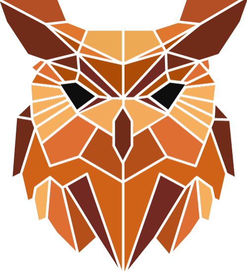

  

# Solidity Owl #

### What is solidity Owl? ###

Solidity Owl is a tool to monitor solidity contract events.

You can easily watch all the events emitted by a smart contract.

**The main technologies used are**:

* React JS
    * React-Redux
    * React-logic
* Immutability helper
* Web3
* HTML5
* CSS3

### How do I get set up? ###

* Clone repo
* Run yarn install
* Run yarn start
* Open browser on localhost:3000
* Fill: 
    * Ethereum endpoint
    * Contract address
    * Contract ABI
    

* Hit connect
* Select the events you want to listen and...
* Voilà!

### Future steps

1) Complete the following sections

* Events
* Transactions: get the transaction info by hash, show event when a transaction is confirmed or cancelled.
* Blocks: get information about a specific block (events, transactions) or block range.
* Contract: general information about the contract, latest block, storage variables.
* Addresses

2) Improve UI/UX

3) Add the possibility to watch multiple contracts

